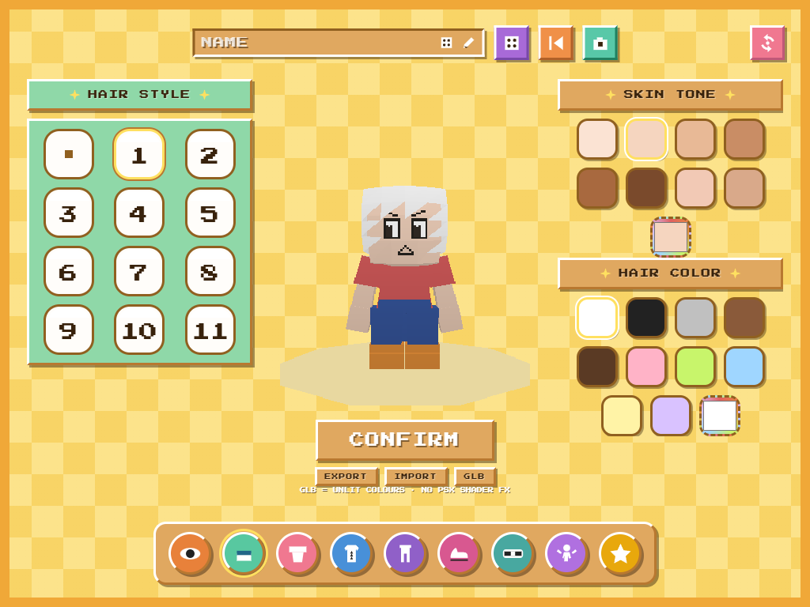

# PSX Character Creator

A PSX-style low-poly character creator that runs entirely in the browser —
retro 32-bit look, vertex-colour rendering, pixelated upscale, hair / outfits /
accessories / poses, and one-click `.glb` export.

**Live demo:** `[https://<your-username>.github.io/psx-creator-kit/](https://tim0phy.github.io/psx-creator-kit/)`



## Features

- **PSX aesthetic** — low-resolution render target upscaled with nearest-neighbour,
  vertex snapping, affine-map feel, flat shading; no PBR / no `MeshStandardMaterial`
  on the character (vertex colours + custom shaders / Lambert flat).
- **Fully procedural** — all geometry, face textures and fabric patterns
  (plaid, stripes, star, denim…) are generated in code/canvas. No external assets.
- **Data-driven catalogue** — every hair, top, bottom, shoe, bag and accessory
  item comes from `catalog.json`; the UI is generated from it, nothing hardcoded.
- **Pose engine** — pose presets, saved poses, photo studio with turnaround
  captures.
- **Export** — config as JSON (import/export), or the posed character as a
  spec-correct `.glb` (unlit vertex colours; note: the PSX shader FX are not
  baked into the file).
- **Persistence** — your character is saved to `localStorage`, plus randomise
  and reset.

## Tech stack

- [Three.js](https://threejs.org/) `0.186`
- [Vite](https://vite.dev/) — vanilla JS ES modules, no framework
- Static site — no backend, no tracking

## Getting started

```bash
npm install
npm run dev      # dev server
npm run build    # production build to dist/
npm run preview  # preview the production build
```

Optional tooling (used during development, requires Playwright browsers):

```bash
npx playwright install chromium
npm run shots    # screenshot suite into shots/
```

## Project layout

```
index.html
src/main.js         bootstrap + render loop
src/psxRenderer.js  low-res render target, upscale, PSX shaders
src/character.js    body rig, part slots, apply(config)
src/faceTexture.js  canvas face layers (skin/eyes/mouth)
src/parts/          hair, tops, bottoms, shoes, bags, outer, socks…
src/patterns.js     procedural canvas patterns
src/catalog.js      loads catalog.json + helpers
src/pose.js         pose engine
src/ui*.js          panels, category bar, pickers, presets
src/exporter.js     GLB export
catalog.json        the item/pose/colour catalogue (single source of truth)
```

## Deployment

Deploys to **GitHub Pages** automatically on every push to `main`
via [`.github/workflows/deploy.yml`](.github/workflows/deploy.yml)
(build with the repo-name base path, upload the Pages artifact, deploy).

To host it yourself anywhere else: `npm run build` and serve `dist/` as static
files.

## License

Distributed under the **ISC licence with the Commons Clause v1.0** condition —
free to use, modify and redistribute, but you may not sell the software itself.
See [LICENSE](LICENSE) for the full text.
